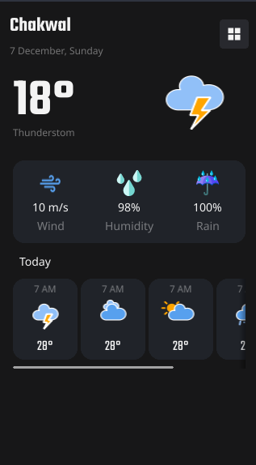
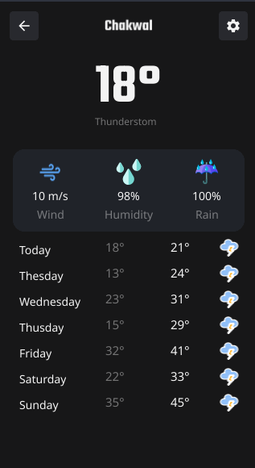

# FyneWeather

FyneWeather leverages the Fyne Framework (https://github.com/fyne-io/fyne) UI capabilities, with a design inspired by Kristina Spiridonova's Weather App for Purrweb UI/UX Agency on Dribbble, ensuring a visually appealing and intuitive user experience. (https://dribbble.com/shots/19768625-Weather-App)

| Today Screen                                      | Weekly Screen                                     |
|--------------------------------------------------|--------------------------------------------------|
|  |  |
